# dsRNA Target Sequence Design

Niko Darci-Maher\
Dr. Andrew Groover Lab\
U.S. Forest Service Northern Research Station\
Burlington, VT

## Background

We want to design dsRNA molecules that will stop the growth of plant fungal pathogens. To do this, we need to design a sequence that matches an essential growth gene in the fungus. If all goes well, when the fungus absorbs dsRNA with this sequence, it will begin degrading mRNA with the same sequence via its native RNAi machinery, and stop growth.

We are testing this with the American chestnut tree (*Castanea dentata*) and its associated fungal blight pathogen (*Cryphonectria parasitica*). We are also designing targets for Dutch Elm Disease (*Ophiostoma novo-ulmi*), Butternut Canker (*Ophiognomonia clavigignenti-juglandacearum* (Ocj)), and Laurel wilt (*Harringtonia lauricola*).

To follow this tutorial, start by cloning this repository.

## Stage 1: Targeting broadly conserved essential genes *in vitro* 

Before worrying about off-target effects, we are just testing if we can stop fungal growth with ANY gene, especially a highly conserved and essential gene. If this doesn't work, there is no reason to design species-specific targets.

We are also not involving the tree at this stage, which introduces additional questions and variables. We will treat *C. parasitica* growing in culture directly with the dsRNAs, and measure its growth over time compared to a control.

### Choosing a dsRNA sequence for a target gene

Following the example of [Degnan et al. *Molecular Plant Pathology* 2022](https://doi.org/10.1111/mpp.13286), we are starting by targeting the *EF1a* gene, Translation Elongation Factor 1a. We will use *Cryphonectria parasitica* as our main target species, but also assess the potential effects on the other three pathogens.

#### Find the target gene in the fungal genome

Because annotations in our *C. parasitica* genome are sparse, start by finding the nucleotide sequence of the *EF1a* gene in the *Austropuccinia Psidii* genome (the organism studied in the Degnan paper).

Referring to [Supplementary Table 1 from the Degnan paper](https://bsppjournals.onlinelibrary.wiley.com/action/downloadSupplement?doi=10.1111%2Fmpp.13286&file=mpp13286-sup-0004-TableS1.docx), the forward primer sequence (minus the T7 promoter, in bold) for *EF1a* in *A. psidii* is:

```
ATGCTCCTGGACATCGTG
```

Copy this sequence, and open the [NCBI BLASTN tool](https://blast.ncbi.nlm.nih.gov/Blast.cgi). Under `Enter Query Sequence`, type a useful fasta header like `>Apsidii_EF1a_primerF`, followed by a newline and the above sequence. Under `Organism`, add `Austropuccinia psidii (taxid:181123)`.

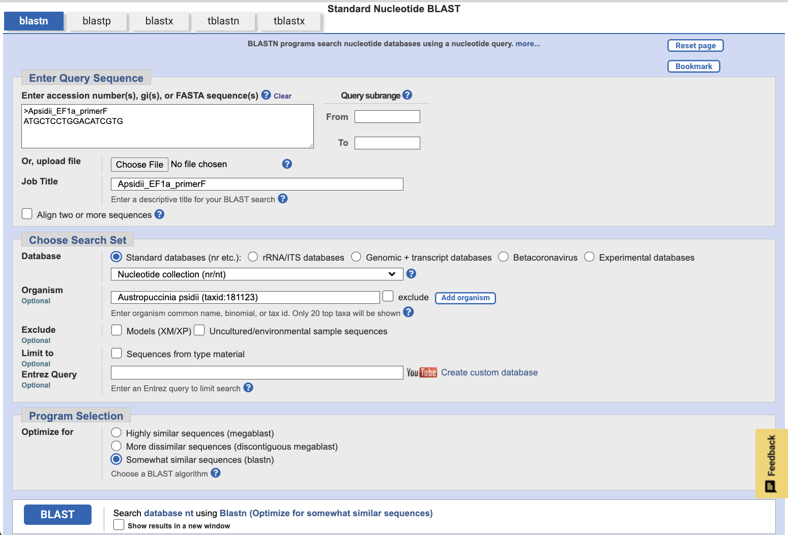

Leave the options at their defaults, and click `BLAST`. This will compare the forward primer sequence against the *A. psidii* genome and return the strongest alignments.

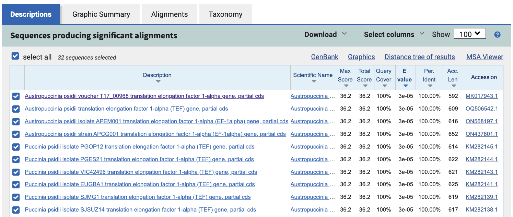

Of the many hits on the results page, the first alignment should give us enough sequence to capture the uniqueness of the *EF1a* gene. Click this first alignment, `Austropuccinia psidii voucher T17_00968 translation elongation factor 1-alpha gene, partial cds`. 

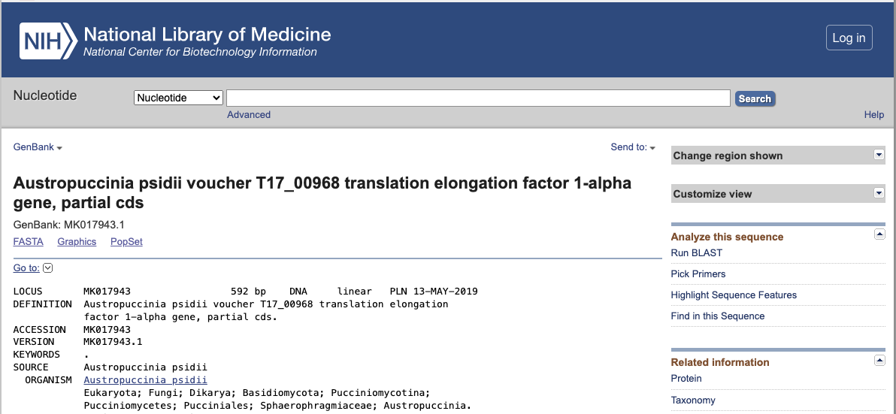

Scroll to the bottom of the gene detail page, and copy the whole nucleotide sequence.

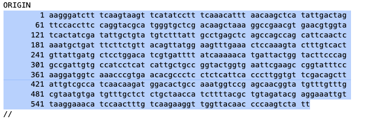

Now, create a new blank text file on your computer, and type in a useful `.fasta` header like ">Apsidii_EF1a_partialCDS_MK017943.1". On a new line below this header, paste the sequence copied from the gene detail page above. Save the file in the `data` directory as `Apsidii_EF1a_partialCDS.fasta`.

Run the following command to trim coordinates and whitespace from the sequence.

```
python scripts/clean_fasta.py data/Apsidii_EF1a_partialCDS.fasta
```

Now, open the `BLAST` tab on the [*C. parasitica* genome website](https://mycocosm.jgi.doe.gov/Crypa2/Crypa2.home.html) at JGI MycoCosm. Under `Query Sequences`, paste the entirety of your new `.fasta` file.

Under `Search Criteria`, select `blastn: blast nucleotide vs. nucleotide`, and click the `Cryphonectria parasitica v2.0 masked nuclear assembly` database. Leave the other settings at their defaults.

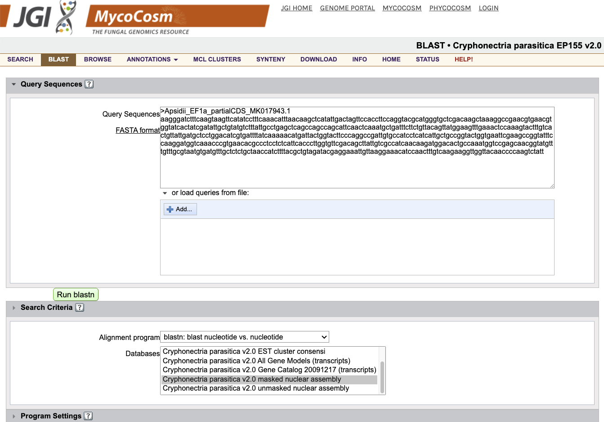

Click `Run blastn`.

This will show you the nucleotide-nucleotide alignments between the chunk of *A. psidii* *EF1a* we selected and the full *C. parasitica* genome.

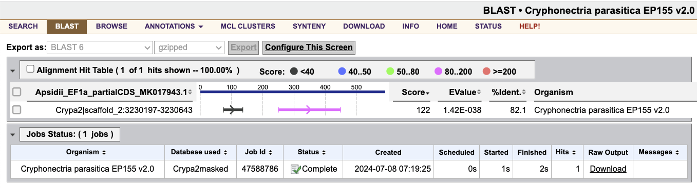

To visualize the gene models in this genomic region, click on the alignment, `Crypa2|scaffold_2:3230197-3230643`. This will take you to the *C. parasitica* genome browser at the alignment position.

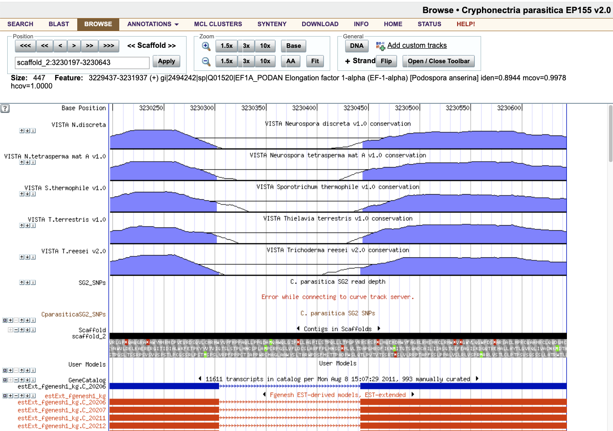

Among many other things, this genome browser interface shows us the gene models that map to the genomic region our query aligned with. Scroll down to the `GeneCatalog` section, and click on the model there (the blue gene). While there are other slightly different splice variants to choose from, their transcript sequence will be so similar, if not identical, that targeting one should target them all.

Clicking this model takes us to its detail page. Most of the annotations under `Interpro Desc` mention "Translation elongation factor", giving some validation that we've found the correct gene.

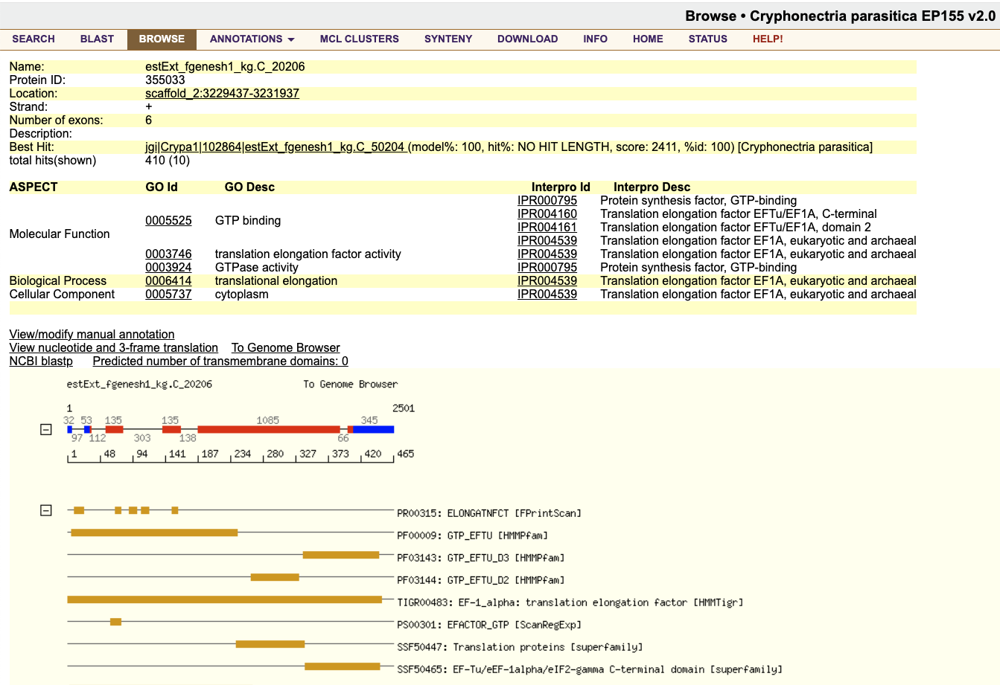

From here, we can work directly with the *C. parasitica* transcript sequence of the *EF1a* gene, rather than the *A. psidii* partial CDS sequence.

#### Check for redundancy across the genome

Now you can use BLAST again to check for copies or family members of this gene in other regions of the *C. parasitica* genome.

To get the transcript/CDS sequence for this gene, click the blue and red exon/intron graphic below the table of information.

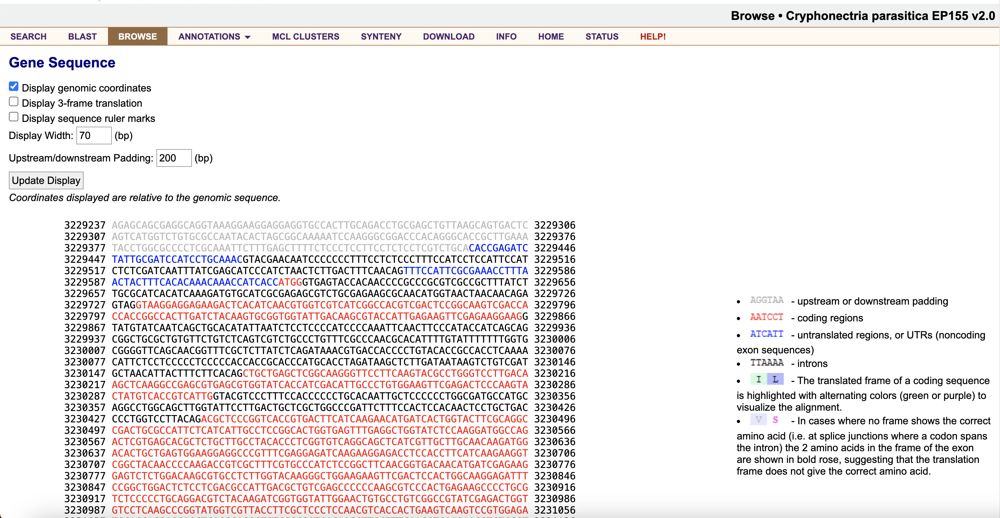

Scroll down to `Transcript(1785 bp)/CDS Sequence(1395 bp)`, and copy the coding sequence (CDS) only (i.e. the red characters).

Open another text file, input another useful FASTA header like `>Cparasitica_EF1a_CDS_355033`, and paste in the *C. parasitica* *EF1a* CDS sequence. Save this file as `data/Cparasitica_EF1a_CDS.fasta`, and clean it up with:

```
python scripts/clean_fasta.py data/Cparasitica_EF1a_CDS.fasta
```

Return to the MycoCosm `BLAST` tab, and paste the entirety of this new `.fasta` file into the `Query Sequences` box.

Again, select `blastn: blast nucleotide vs. nucleotide`, and click the `Cryphonectria parasitica v2.0 masked nuclear assembly` database. Leave the other settings at their defaults.

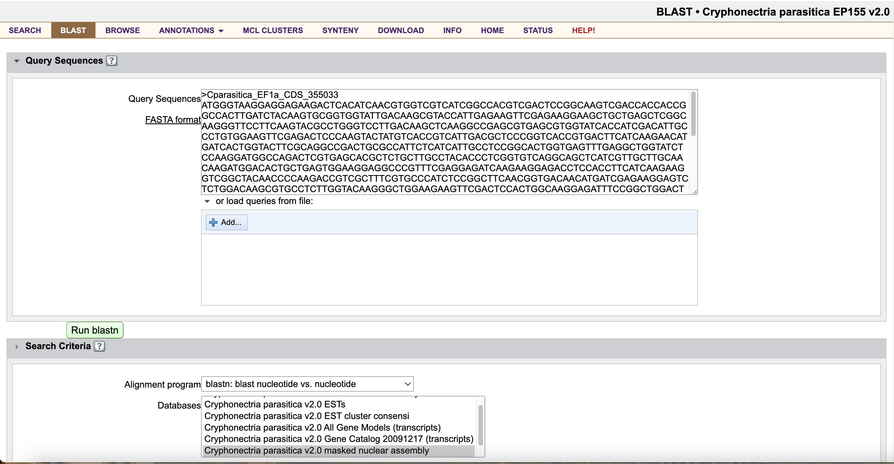

Click `Run blastn`.

This will show you the nucleotide-nucleotide alignments between *C. parasitica* *EF1a* and the full *C. parasitica* genome. We use the CDS nucleotide sequence because this is the functional mRNA sequence that we will be targeting in the living fungus.

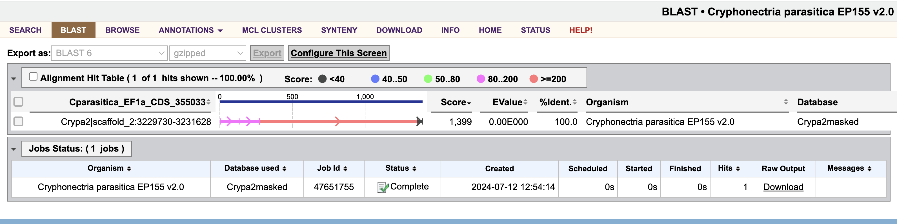

Fortunately, there is just one hit across the entire genome, making this gene a promising target. Hopefully, when the gene is silenced, a redundant family member will not replace its function.

#### Find the most conserved region across target species

The next step is to check whether this same target gene sequence exists in the three other target fungal species. To start this, open up [NCBI BLAST](https://blast.ncbi.nlm.nih.gov/Blast.cgi), and click `Nucleotide BLAST`. Upload the same *C. parasitica* *EF1a* transcript CDS sequence from before, `data/Cparasitica_EF1a_CDS.fasta`. Use the `Add organism` button to add our four species: 
* Cryphonectria parasitica EP155 (taxid:660469)
* Ophiostoma novo-ulmi subsp. novo-ulmi (taxid:170179)
* Ophiognomonia clavigignenti-juglandacearum (taxid:218668)
* Harringtonia lauricola (taxid:483707)

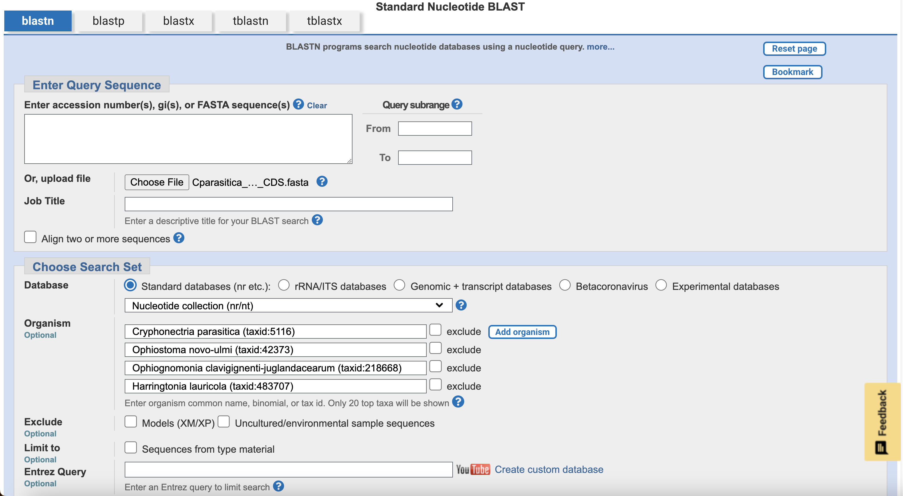

Leave the other settings at their defaults, and click `BLAST`.

Once the job finishes running, the results page will show you the nucleotide-nucleotide alignments across all four species.

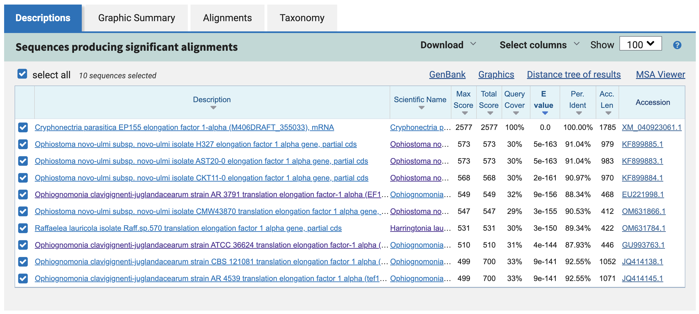

This table gives you information about each of the 10 hits across the four genomes. Promisingly, all four species are represented, and every hit has an annotation related to "Translation Elongation Factor 1 alpha." It also makes sense that the *C. parasitica* hit is at the top of the table, with 100% identity to the query.

Exploring the results further, the `Graphic Summary` tab shows you how each of the BLAST hits align to each other along the sequence.

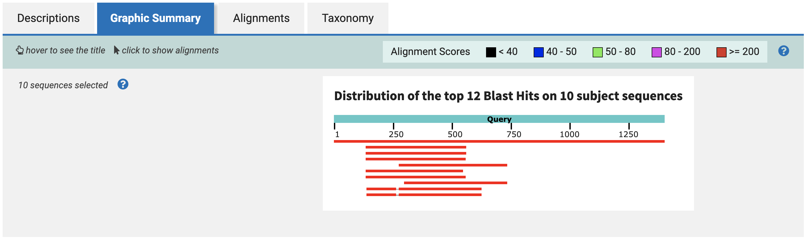

This plot suggests that there is a ~250bp region, between bases 250 and 500 in the query, that is largely conserved across all four species. 

This is ideal for us, because 250bp is a useful length - both for imaging on electrophoresis gels, and for pulling a high yield from RNA synthesis kits.

You can explore another interesting piece of the NCBI BLAST results by clicking `Distance tree of results`. This tool generates a distance tree based on the pairwise alignments to the query sequence.

Note that this is not necessarily a robust phylogenetic tree, only a clustering of sequences based on the ~1400bp query we input to BLAST.

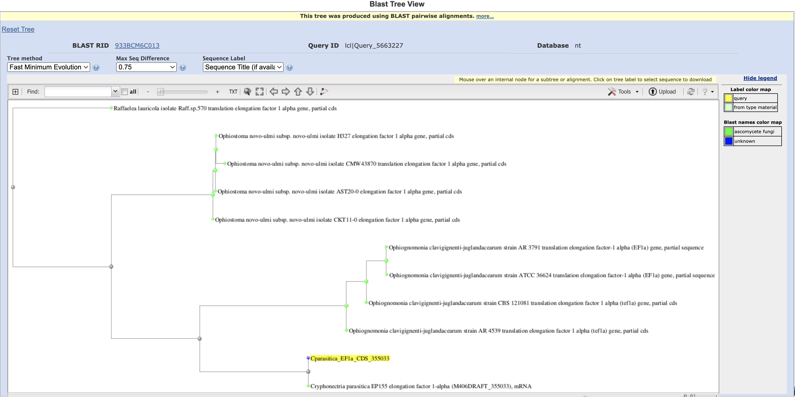

Promisingly, though, all four species cluster into their own sub-trees, and the *C. parasitica* hit clusters most closely to the query. It also turns out that *Cryphonectria* and *Ophiognomonia* belong to the same order, *Diaporthales*, while the other two species belong to the order *Ophiostomatales*. This could explain why *Cryphonectria* and *Ophiognomonia* form their own sub-tree as well.

#### Select a final dsRNA sequence

From here, we can now choose our final 250bp dsRNA sequence to target the *EF1a* gene in all four fungal pathogen species.

Back in the `Graphic Summary` tab, select the rightmost-aligning sequence, and click `Alignment`. We choose the rightmost-aligning sequence to maximize the amount of overlap across all 10 hits with a single 250bp sequence.

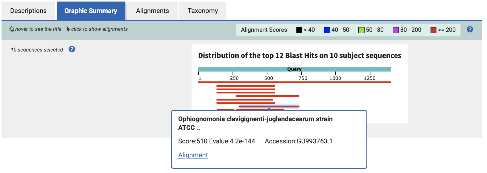

This page shows base-by-base alignment for the Ocj *EF1a* gene to the query sequence. Notice that the alignment graphic starts with `Query` coordinate 298, where `Sbjct` coordinate is 1. This means our final dsRNA sequence will be the 250 bases starting at base 298 in the original *C. parasitica* *EF1a* transcript CDS sequence (the query). 

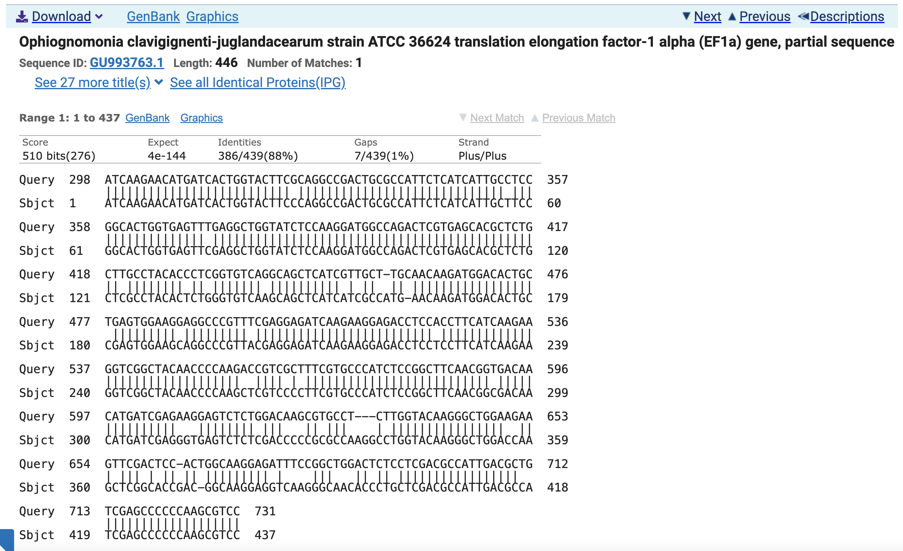

To produce a `.fasta` file with this sequence, run the following command in the terminal:

```
python scripts/slice_fasta.py 298 250 data/Cparasitica_EF1a_CDS.fasta data/dsRNA_sequence_Cparasitica_EF1a_250bp.fasta
```

This will produce a new `.fasta` file called `data/dsRNA_sequence_Cparasitica_EF1a_250bp.fasta`, which contains the desired sequence.

#### Re-check redundancy with the final sequence

All that's left to do now is to run one final BLAST, verifying that our chosen dsRNA sequence aligns with all four species in the way we would expect. Return to NCBI nucleotide BLAST, and upload the `data/dsRNA_sequence_Cparasitica_EF1a_250bp.fasta` file as the query sequence, with all 4 fungal species added.

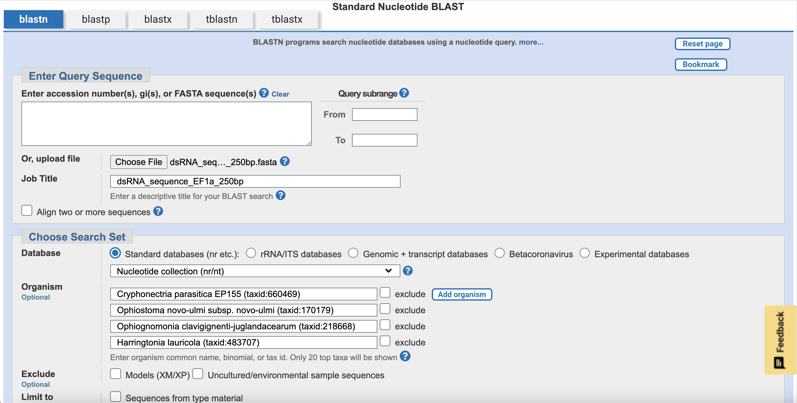

In order to recover all 10 original hits from the *EF1a* CDS BLAST for this specific region and set of species, I did need to decrease the search stringency by changing the `Program Selection` -> `Optimize for` setting from `Highly similar sequences (megablast)` to `More dissimilar sequences (discontinuous megablast)`. We are still considering this valid, with the idea that the ultimate test of effectiveness is still the biological result, and that these BLAST parameter thresholds are somewhat arbitrary.

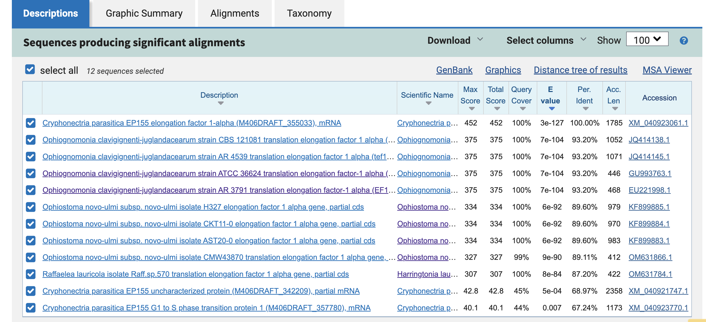

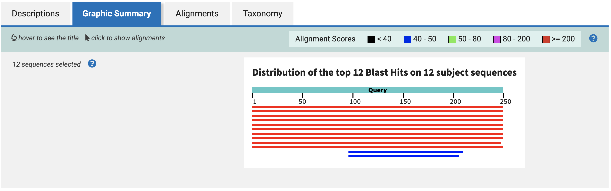

These outputs show us the same 10 hits from the CDS blast (plus two low-scoring alignments), this time aligning only to the 250bp dsRNA sequence. Notice the near-total coverage across all hits in the graphic summary. Hopefully, this will translate to growth inhibition *in vitro*!

#### Repeat the process with other target genes

Data files from repeating this process with the other target genes, to varying degrees of success, are stored in the `data` folder.

Exceptions:
* For *BTUB*, I used `Ophiostoma novo-ulmi (taxid:42373)` instead of `Ophiostoma novo-ulmi subsp. novo-ulmi (taxid:170179)` to recover alignments for that species.
* The 28S1 rRNA gene had good hits in the *A. psidii* genome, and the partial CDS sequence from there mapped to *C. parasitica*. But the gene models in the mapped region of *C. parasitica* were too short and fragmented to use.  
* For *ATC*, *MAPK*, and *CYP450*, the NCBI BLAST search in the *A. psidii* genome only returns hits for *EF1a*, *BTUB*, and some other ITS and rRNA regions. Maybe these short primer sequences are not specific enough to single out their target gene genome-wide?

#### Generate target sequences for other pathogen species

Now that we have dsRNA sequences for two target genes in *C. parasitica*, we can use the NCBI BLAST alignments across all four species to generate similar, but not identical, dsRNA sequences for *O. novo-ulmi*, *Ocj*, and *H. lauricola*. We can use *O. novo-ulmi* and *EF1a* as an example, and extend this process to the other two species and *BTUB*.

Return to the NCBI blast results for the *C. parasitica* *EF1a* CDS, by uploading `data/Cparasitica_EF1a_CDS.fasta` as the query, adding all four pathogen species, and clicking `BLAST`.

In the table of results, find the *O. novo-ulmi* alignment with the lowest E value (earliest in the table) and click on it. 

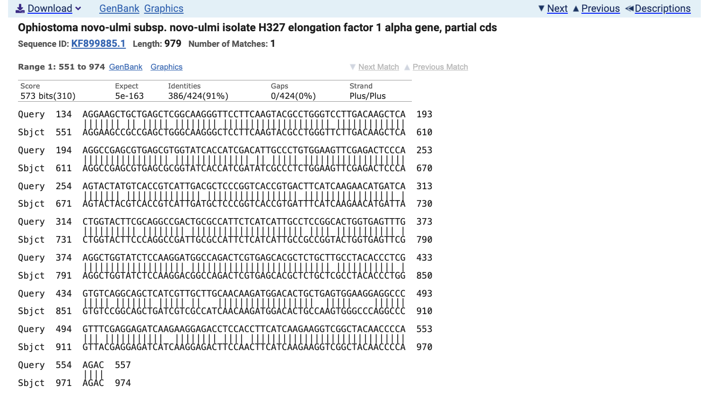

On the first row of the alignment graphic, notice how the output says `Query 134` and `Sbjct 551`. From this information, we know that the alignment starts at base 551 in the *O. novo-ulmi* gene. Now, instead of selecting 250bp from the *C. parasitica* sequence starting at this point, we will select 250bp from the *O. novo-ulmi* sequence.

To do this, click on the accession link, `KF899885.1`. Scroll down to the `ORIGIN` header and copy the entire CDS sequence there. Paste the sequence into a new `.fasta` file in the `data` folder with a useful header like `>Onovoulmi_EF1a_partialCDS_KF899885.1`. Save this file as `data/Onovoulmi_EF1a_partialCDS.fasta`, and clean it up:

```
python scripts/clean_fasta.py data/Onovoulmi_EF1a_partialCDS.fasta
```

Now, select 250bp starting at position 551 in the *O. novo-ulmi* partial CDS for *EF1a*:

```
python scripts/slice_fasta.py 551 250 data/Onovoulmi_EF1a_partialCDS.fasta data/dsRNA_sequence_Onovoulmi_EF1a_250bp.fasta
```

From here, repeat this process with the other two pathogen species in the *EF1a* alignment, and then repeat with *BTUB*. The data files from this process are also stored in the `data` folder.

#### Order oligos to produce dsRNA molecules

The final task in this process is now to order DNA molecules with the 250bp sequence stored in `data/dsRNA_sequence_Cparasitica_EF1a_250bp.fasta`, and use molecular kits to convert these molecules to dsRNA.
