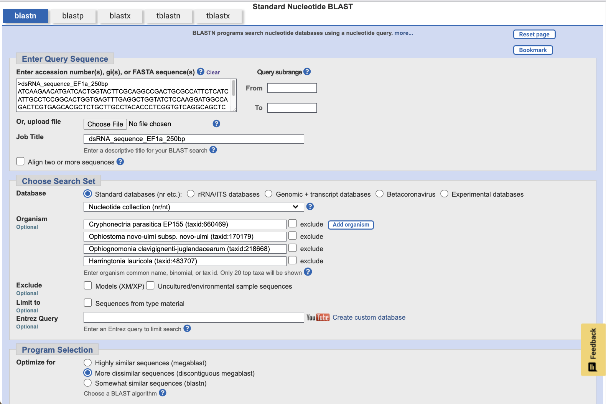

# dsRNA Target Sequence Design

Niko Darci-Maher\
Dr. Andrew Groover Lab\
U.S. Forest Service Northern Research Station\
Burlington, VT

## Background

We want to design dsRNA molecules that will stop the growth of plant fungal pathogens. To do this, we need to design a sequence that matches an essential growth gene in the fungus. If all goes well, when the fungus absorbs dsRNA with this sequence, it will begin degrading mRNA with the same sequence via its native RNAi machinery, and stop growth.

We are testing this with the American chestnut tree (*Castanea dentata*) and its associated fungal blight pathogen (*Cryphonectria parasitica*). We are also designing targets for Dutch Elm Disease (*Ophiostoma novo-ulmi*), Butternut Canker (*Ophiognomonia clavigignenti-juglandacearum* (Ocj)), and Laurel wilt (*Harringtonia lauricola*).

## Stage 1: Targeting broadly conserved essential genes *in vitro* 

Before worrying about off-target effects, we are just testing if we can stop fungal growth with ANY gene, especially a highly conserved and essential gene. If this doesn't work, there is no reason to design species-specific targets.

We are also not involving the tree at this stage, which introduces additional questions and variables. We will treat *Cryphonectria* growing in culture directly with the dsRNAs, and measure its growth over time compared to a control.

### Choosing a dsRNA sequence for a target gene

Following the example of [Degnan et al. Molecular Plant Pathology 2022](https://doi.org/10.1111/mpp.13286), we are starting by targeting the *EF1a* gene, Translation Elongation Factor 1a. We will use *Cryphonectria parasitica* as our main target species, but also assess the potential effects on the other three pathogens.

#### Find the target gene in the fungal genome

Because annotations in fungal genomes are typically sparse, start by taking the *EF1a* protein sequence from the model plant organism *Arabidopsis thaliana*. 

Use the [TAIR database](https://www.arabidopsis.org/) to search for the *EF1a* protein. Make sure to choose `Protein` from the drop down list before clicking the search button.


Click the first isoform, `AT1G07940.1`. On the protein detail page, scroll down to `Sequence`, and click `Send to BLAST`. Copy the amino acid sequence in the `Input` box.


Open a text editor, and type in a useful FASTA header like `>At_EF1a_prot`. Then, paste in the *Arabidopsis* *EF1a* protein sequence. Save the file as `At_EF1a_prot.fasta`, and clean up whitespace by running the following in your terminal:

```
python clean_fasta.py At_EF1a_prot.fasta
```

Now, open the `BLAST` tab on the [*Cryphonectria* genome website](https://mycocosm.jgi.doe.gov/Crypa2/Crypa2.home.html) at JGI MycoCosm. Under `Query Sequences`, paste the entirety of your new `.fasta` file.

Under `Search Criteria`, select `blastp: blast protein vs. protein`, and click the `Cryphonectria parasitica v2.0 All Gene models (proteins)` database. Leave the other settings at their defaults.


Click `Run blastp`.

This will show you the protein-protein alignments between *Arabidopsis* *EF1a* and every protein in *Cryphonectria*. We use protein sequences because these will be more conserved across plants and fungi than nucleotide sequences.


There are 85 hits, and the first few dozen are essentially the same protein from the same coordinates, with slightly varying splice patterns. Their transcript sequence will be so similar, if not identical, that targeting one should target them all.

Click the first hit, `Crypa2|355031` (note that different BLAST runs may produce different orderings of these first few near-synonymous proteins, I am not sure how to explain this). This page displays lots of information about the protein.


Notice that the computationally-generated annotations list "Translation Elongation Factor EF1A" multiple times — some validation that this is the right gene!

To get the genomic DNA and transcript sequence for this gene, click the blue and red exon/intron graphic below the table of information.

On this new page, uncheck `Display genomic coordinates` and click `Update Display` to make copy-pasting easier.


From here, we can work directly with the *Cryphonectria* transcript sequence of the *EF1a* gene, rather than the *Arabidopsis* protein sequence.

#### Check for redundancy across the genome

This allows us to use BLAST again to check for copies or family members of this gene in other regions of the *Cryphonectria* genome.

Scroll down to `Transcript(1867 bp)/CDS Sequence(1395 bp)`, and copy the coding sequence (CDS) only (i.e. the red characters).

Open another text file, input another useful FASTA header like `>Cp_EF1a_tx_cds`, and paste in the *Cryphonectria* *EF1a* CDS sequence. Save this file as `Cp_EF1a_tx_cds.fasta`, and clean it up with:

```
python clean_fasta.py Cp_EF1a_tx_cds.fasta
```

Return to the MycoCosm `BLAST` tab, and paste the entirety of this new `.fasta` file into the `Query Sequences` box.

This time, under `Search Criteria`, select `blastn: blast nucleotide vs. nucleotide`, and click the `Cryphonectria parasitica v2.0 masked nuclear assembly` database. Leave the other settings at their defaults.


Click `Run blastn`.

This will show you the nucleotide-nucleotide alignments between *Cryphonectria* *EF1a* and the full *Cryphonectria* genome. We use the CDS nucleotide sequence because this is the functional mRNA sequence that we will be targeting in the living fungus.


Fortunately, there is just one hit across the entire genome, making this gene a promising target. Hopefully, when the gene is silenced, a redundant family member will not replace its function.

#### Find the most conserved region across target species

The next step is to check whether this same target gene sequence exists in the three other target fungal species. To start this, open up [NCBI BLAST](https://blast.ncbi.nlm.nih.gov/Blast.cgi), and click `Nucleotide BLAST`. Upload the same *Cryphonectria* *EF1a* transcript CDS sequence from before, `Cp_EF1a_tx_cds.fasta`. Use the `Add organism` button to add our four species: 
* Cryphonectria parasitica EP155 (taxid:660469)
* Ophiostoma novo-ulmi subsp. novo-ulmi (taxid:170179)
* Ophiognomonia clavigignenti-juglandacearum (taxid:218668)
* Harringtonia lauricola (taxid:483707)


Leave the other settings at their defaults, and click `BLAST`.

Once the job finishes running, the results page will show you the nucleotide-nucleotide alignments across all four species.


This table gives you information about each of the 10 hits across the four genomes. Promisingly, all four species are represented, and every hit has an annotation related to "Translation Elongation Factor 1 alpha." It also makes sense that the *Cryphonectria* hit is at the top of the table, with 100% identity to the query.

Exploring the results further, the `Graphic Summary` tab shows you how each of the BLAST hits align to each other along the sequence.


This plot suggests that there is a ~250bp region, between bases 250 and 500 in the query, that is conserved across all four species. 

This is ideal for us, because 250bp is a useful length - both for imaging on electrophoresis gels, and for pulling a high yield from RNA synthesis kits.

You can check out another interesting piece of the NCBI BLAST results by clicking `Distance tree of results`. This tool generates a distance tree based on the pairwise alignments to the query sequence.

Note that this is not necessarily a robust phylogenetic tree, only a clustering of sequences based on the ~1400bp query we input to BLAST.


Promisingly, though, all four species cluster into their own sub-trees, and the *Cryphonectria* hit clusters most closely to the query. It also turns out that *Cryphonectria* and *Ophiognomonia* belong to the same order, *Diaporthales*, while the other two species belong to the order *Ophiostomatales*. This could explain why *Cryphonectria* and *Ophiognomonia* form their own sub-tree as well.

#### Select a final dsRNA sequence

From here, we can now choose our final 250bp dsRNA sequence to target the *EF1a* gene in all four fungal pathogen species.

Back in the `Graphic Summary` tab, select the rightmost-aligning sequence, and click `Alignment`. We choose the rightmost-aligning sequence to maximize the amount of overlap across all 10 hits with a single 250bp sequence.


This page shows base-by-base alignment for the Ocj *EF1a* gene to the query sequence. Notice that the alignment graphic starts with `Query` coordinate 298, where `Sbjct` coordinate is 1. This means our final dsRNA sequence will be the 250 bases starting at base 298 in the original *Cryphonectria* *EF1a* transcript CDS sequence (the query). 


To produce a `.fasta` file with this sequence, run the following command in the terminal:

```
python slice_fasta.py 298 250 Cp_EF1a_tx_cds.fasta dsRNA_sequence_EF1a_250bp.fasta
```

This will produce a new `.fasta` file called `dsRNA_sequence_EF1a_250bp.fasta`, which contains the desired sequence.

#### Re-check redundancy with the final sequence

All that's left to do now is to run one final BLAST, verifying that our chosen dsRNA sequence aligns with all four species in the way we would expect. Return to NCBI nucleotide BLAST, and upload the `dsRNA_sequence_EF1a_250bp.fasta` file as the query sequence, with all 4 fungal species added.



In order to recover all 10 original hits from the CDS BLAST for this specific region and set of species, I did need to decrease the search stringency by changing the `Program Selection` -> `Optimize for` setting from `Highly similar sequences (megablast)` to `More dissimilar sequences (discontinuous megablast)`. We are still considering this valid, with the idea that the ultimate test of effectiveness is still the biological result, and that these BLAST parameter thresholds are somewhat arbitrary.

#### Order oligos to produce dsRNA molecules

The final task in this process is now to order DNA molecules with the 250bp sequence stored in `dsRNA_sequence_EF1a_250bp.fasta`, and use molecular kits to convert these molecules to dsRNA!

Next steps include designing other dsRNA sequences for alternate target genes, and designing scrambled dsRNAs with fluorescent labels for the uptake assay.

